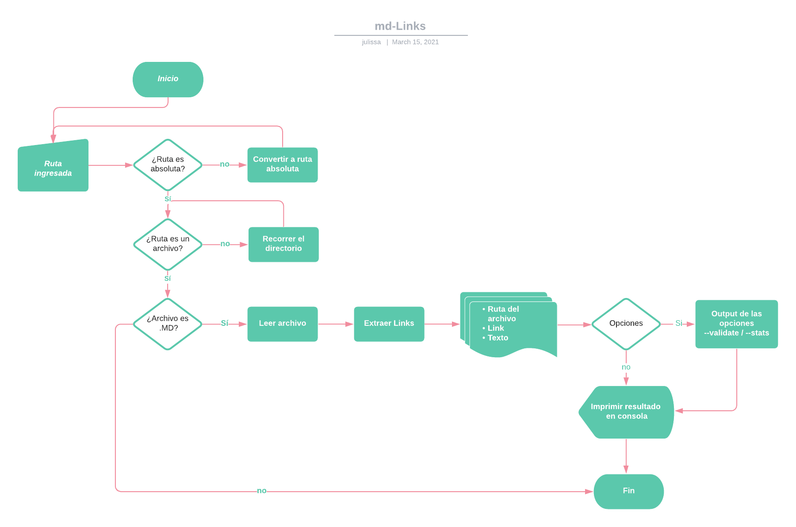
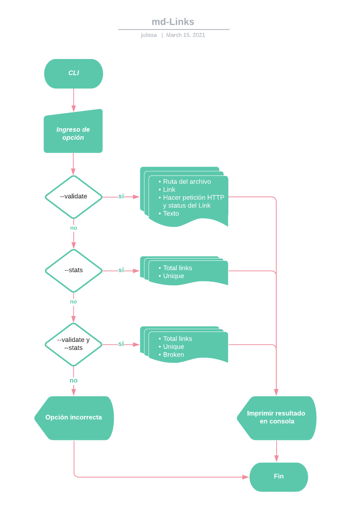

# Markdown Links

## Índice

* [1. Definición del Producto](#1-definición-del-producto)
* [2. Diagrama de flujo](#2-diagrama-de-flujo)
* [3. Instalación](#3-instalación)
* [4. Guía de uso](#4-guía-de-uso)

***

## 1. Definición del Producto

Markdown es un lenguaje de marcado muy popular en plataformas que manejan texto planos, tales como GitHub, foros, blogs, entre otros y es muy común encontrarlo por ejemplo en archivos 'README.md'.

La librería `md-links` -creada con [Node.js](https://nodejs.org/)- se encarga de leer y analizar los archivos en formato
[Markdown](https://es.wikipedia.org/wiki/Markdown)  para verificar los links que contengan y reportar algunas estadísticas, ya que muchos de estos links pueden encontrarse rotos o ya no son válidos y perjudican el valor de la información que se desea compartir.

## 2. Diagrama de flujo
Para poder implementar esta librería, se realizaron 2 diagramas de flujo para cada módulo.

### 1) API

### 2) CLI (Command Line Interface - Interfaz de Línea de Comando)

## 3. Instalación

Por npm:

`$ npm i lim014-mdlinks`

Por repo de github:

`$ npm i --global julissah/LIM014-mdlinks`

## 4. Guía de uso

### API

Para acceder a `mdLinks`, debemos importarla con:

`const mdLinks = require('lim014-mdlinks')`

mdLinks recibe
mdLinks recibe dos parámetros: `path` (ruta absoluta o relativa) y `option`, retornando un array de objetos por cada link encontrado con sus propiedades (href, text y file).

**Ejemplo:**

### CLI
En la línea de interfaz de comando (CLI), podemos ingresar los siguientes comando:

`md-links <path-to-file> [options]`

* 
* 
* 
* 

Si solo se ingresa la ruta sin opciones, retornará el file, href y text de cada uno de los links encontrados.

Si se ingresa la opción `--validate`, retornará el file, href y el texto de los links encontrados, además del status (200, 404, 500) y su mensaje respectivo (ok o fail).

Si se ingresa la opción `--stats`, el resultado serán el total de links encontrados y los links únicos (sin repetir).

Tambien puede ingresar ambas opciones (`--stats --validate`), mostrará la cantidad total de links, links sin repetir y links rotos.

Tambien puede ingresar la opción (`--help`), para saber mas de las opciones.

